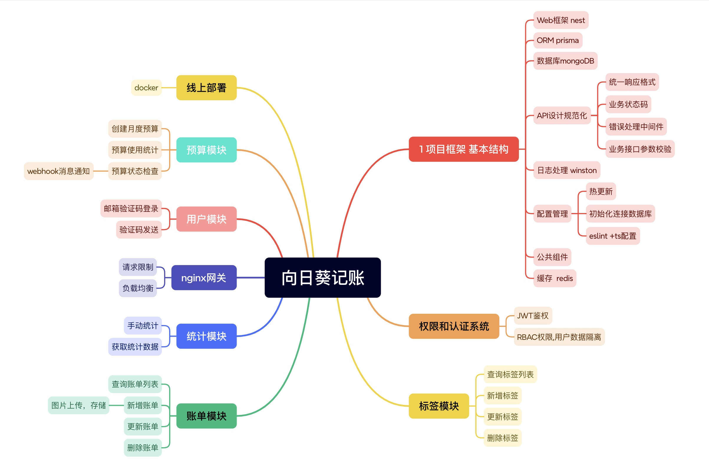

# 向日葵记账 API

## 技术栈

- **Web框架**: NestJS + Fastify
- **ORM**: Prisma
- **数据库**: MongoDB

## 已实现功能

### 用户管理
- [x] 邮箱验证码登录

### 账单管理
- [x] 查看账单列表
- [x] 新增账单
- [x] 删除账单
- [x] 编辑账单

### 标签管理
- [x] 新建标签
- [x] 更新标签
- [x] 删除标签
- [x] 查询标签列表

### 预算管理
- [x] 设置月度预算
- [x] 查询预算使用情况
- [x] 预算超支预警

### 系统功能
- [x] 接口限流
- [x] 权限管理
- [x] 用户认证和授权
- [x] 定时任务
- [x] 实时通知功能
- [x] 日志记录
- [x] 文件存储功能

## 开发环境

- 本项目使用 Bun 作为包管理器和运行时
- 同时保持对 npm/yarn/pnpm 的兼容性

## 计划中的功能

- [ ] ELK实现数据过滤和搜索
- [ ] GraphQL API
- [ ] Docker容器化部署
- [ ] 用户数据隔离
- [ ] 微信登录支持

