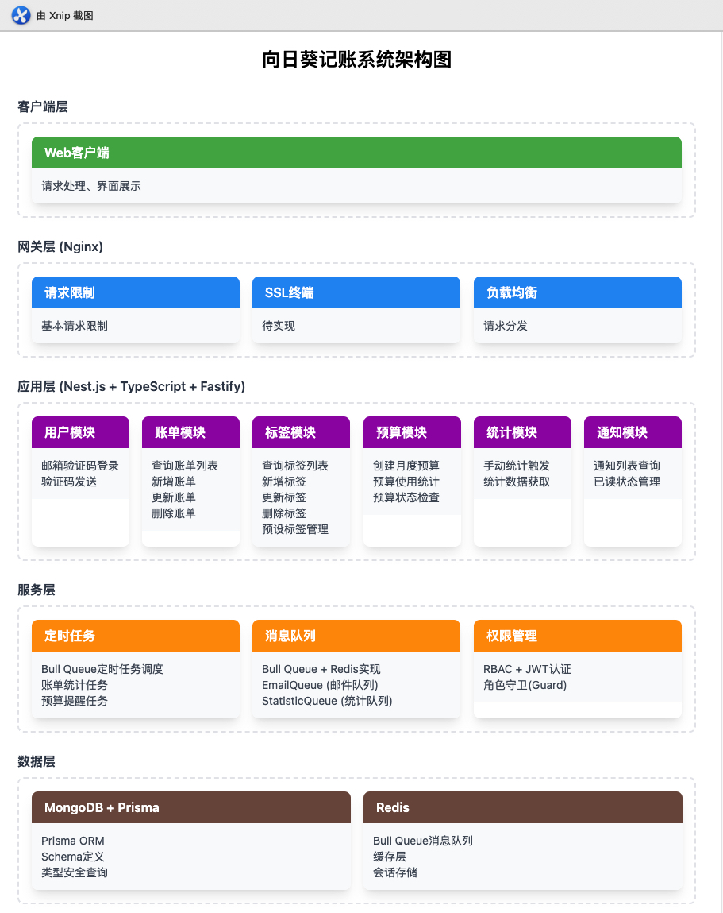
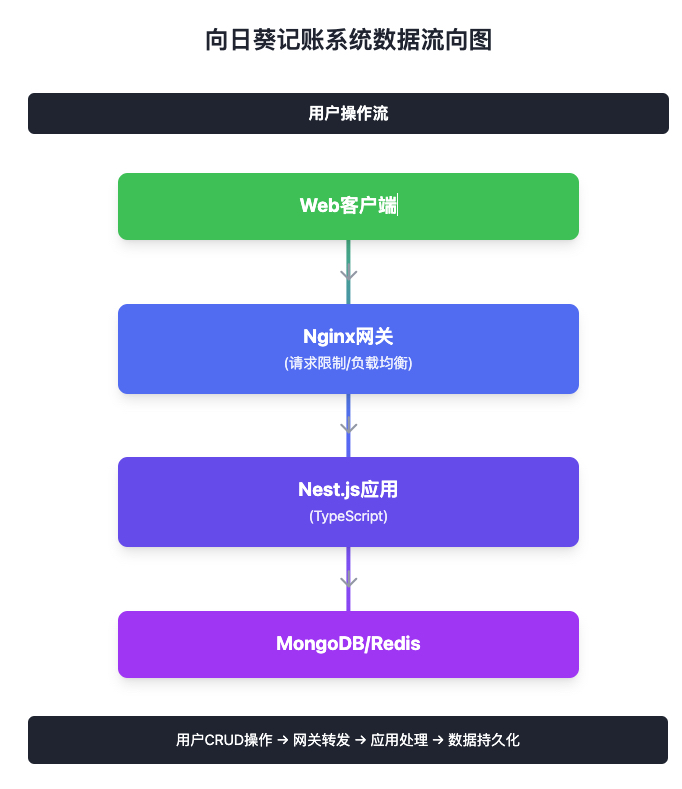

# 向日葵记账系统 - 技术分享文档

## 1. 项目概述

### 1.1 项目背景与目标
向日葵记账系统是仿照微信记账的个人财务管理应用练习项目，本项目采用前后端分离架构，后端使用 Nest.js 框架，前端可以支持多端应用。

### 1.2 核心功能
- **用户认证与授权**：基于 JWT 的安全认证系统，支持邮箱验证码登录
- **账单管理**：记录、查询、编辑和删除账单
- **标签系统**：自定义和预设标签分类
- **预算管理**：月度总预算和标签预算设置
- **数据统计与分析**：日/月度账单统计，标签使用分析
- **通知系统**：预算提醒、系统通知等
- **权限管理**：基于 RBAC 的多角色权限控制

## 2. 技术架构

### 2.1 技术栈选型
- 后端框架：Nest.js + Fastify
- 数据库：MongoDB
- ORM：Prisma
- 消息队列：用于异步处理邮件、统计任务等
- 缓存：Redis 用于数据缓存和会话管理
- 网关：Nginx 处理 SSL、请求限制等
- 包管理器：可以使用 Bun或npm，同时保持对其他包管理器的兼容性

### 2.2 系统架构图

### 2.3 分层架构
1. 网关层：处理 SSL、请求限制、访问日志、基础监控
2. 业务层：处理核心业务逻辑、权限控制、数据处理
3. 数据访问层：通过 Prisma ORM 与数据库交互
4. 服务层：包含消息队列、定时任务等支持服务

### 2.4 数据流向 

## 3. API 设计
系统 API 遵循 RESTful 设计原则，主要模块包括：
- 用户模块：登录、验证码发送等
- 标签模块：标签的 CRUD 操作
- 账单模块：账单的 CRUD 和统计
- 预算模块：总预算和标签预算管理
- 通知模块：系统通知管理

所有 API 都采用统一的响应格式，包含状态码、消息和数据三部分，便于前端处理。

## 4. 技术亮点

### 4.1 开发效率
- Nest.js 框架提供良好的开发体验
- Prisma ORM 简化数据库操作
- 统一的错误处理和响应格式
- 使用winston做日志系统便于调试

## 5. 未来规划
- 实现 ELK 日志系统，提升日志分析能力
- 添加 GraphQL 支持，优化 API 查询效率
- 实现文件上传功能，支持图片存储
- 部署 CDN，提升静态资源访问速度
- 采用docker线上部署